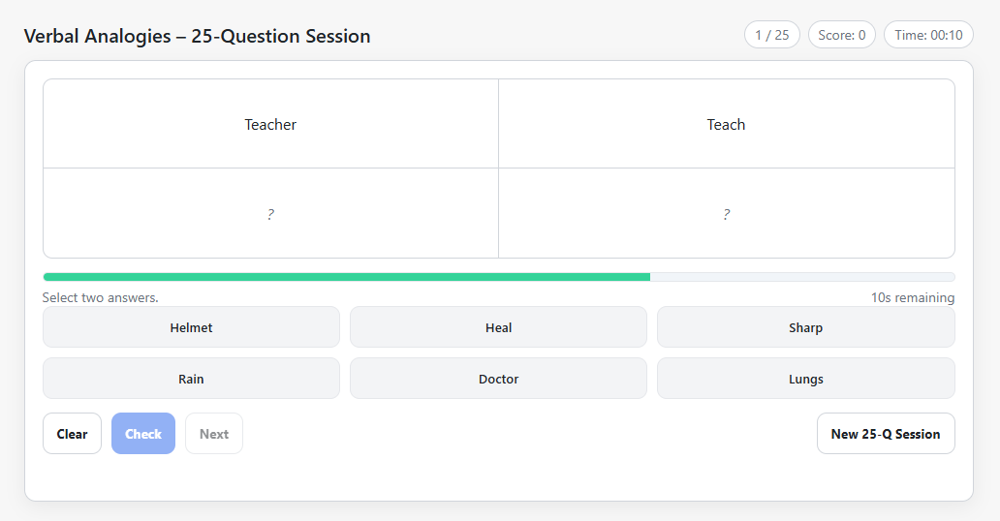
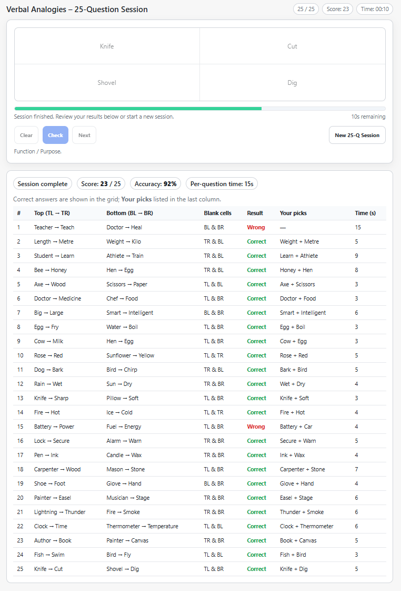

# Verbal Analogies Practice App

A simple browser-based app to practice **verbal analogy test questions** (TPI style).  
Built as a single `index.html` file — no frameworks or servers needed.

## 🔗 Live Demo
👉 [Practice Now](https://fr3nchey.github.io/verbal-analogies/)

Accessible from desktop, tablet, or phone.

---

## 📸 Screenshot
Here’s what the app looks like in action:



---

## ✨ Features
- 25-question randomized session every run  
- Per-question timer (auto-reveals when time runs out)  
- Randomized blank cell positions (top, bottom, diagonal)  
- Score tracking and final result summary  
- Lightweight — runs in the browser only  

---

## 🚀 How to Run Locally
1. Clone the repo:
   ```bash
   git clone https://github.com/Fr3nchey/verbal-analogies.git
   cd verbal-analogies
